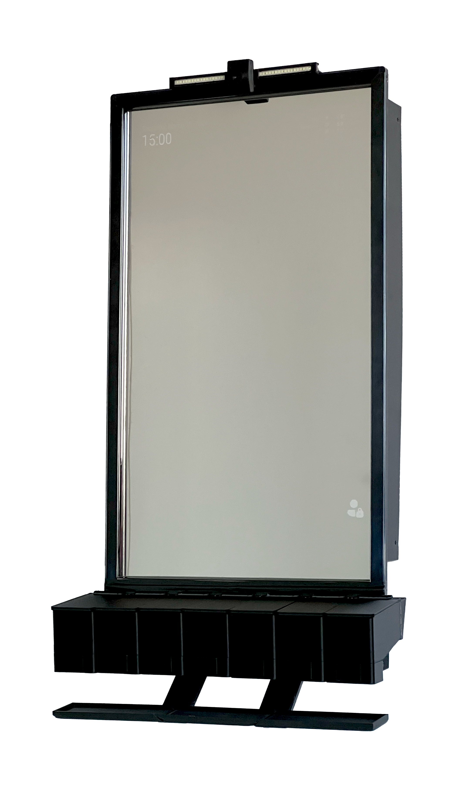

# Smart Medicine Cabinet Capstone Project

## Overview

The Smart Medicine Cabinet project is a system designed to automate medication management.
Developed by students of the Faculty of Engineering and Applied Science, this system integrates hardware and software
components to provide reminders, dispense medications, and enable remote monitoring for seniors with chronic conditions.
The project leverages a Raspberry Pi as its central computing unit, equipped with a touchscreen display for interaction,
mechanically controlled pill dispensers for accurate medication delivery, and sensors including a camera and IR touch
interface for operational control and intake verification. The software architecture utilizes the MagicMirror Framework
to create a modular, customizable interface, supplemented by cloud services for data synchronization and caregiver
access. This proof-of-concept aims to simplify medication management, enhancing adherence and independence for users
while offering caregivers a reliable monitoring solution.

## Features

- **Medication Storage and Cataloging**: Secure and organized storage of medications with easy cataloging and
  accessibility.
- **Automated Medication Reminders**: Visual and auditory notifications to remind patients of medication times,
  enhancing adherence.
- **Medication Intake Verification**: Utilizes computer vision to confirm patient medication intake, ensuring doses are
  not missed.
- **Online Caregiver Monitoring**: Allows caregivers to monitor patient medication schedules, intake, and adherence
  remotely via a secure portal.
- **Interactive User Interface**: Built with the MagicMirror Framework for a customizable, modular, and user-friendly
  experience.

## Components

### Hardware

- Raspberry Pi: Central computing unit running MagicMirror software.
- Touchscreen Display: Interactive interface for medication management.
- Pill Dispensers: Mechanically controlled dispensers for accurate medication delivery.
- Additional Sensors: Including a camera and IR touch interface for operational control and intake verification.

### Software

- **Cabinet Layer Architecture**: Comprising presentation, business, and data layers for a structured and efficient
  system organization.
- **Cloud Services**: For data synchronization and remote caregiver monitoring, ensuring data integrity and
  accessibility.
- **Computer Vision**: Python scripts utilizing the MediaPipe library for real-time medication intake verification.

## Installation

To set up the Smart Medicine Cabinet system, clone this repository to your Raspberry Pi and follow the setup
instructions detailed in the [user manual](/documentation/user_manual.pdf).

The Caretaker Portal repository can be found [here](https://github.com/himapaul10/caretakerportal).

## Usage

Refer to the [user manual](/documentation/user_manual.pdf) for detailed instructions on how to use the Smart Medicine
Cabinet, including medication input, scheduling, and system interaction.

## Assembly

All parts designed for this project can be found in the [parts folder](/parts/). 

Every part was 3D printed in place without supports,
except for the [Dispenser Container](/parts/dispenser%20assembly/dispenser/Container.stl) and
the [Dispenser Lid](/parts/dispenser%20assembly/dispenser/Lid.stl) (printed on its side for proper hinge functionality),
using [Duramic 3D Black PLA+ Filament](https://www.amazon.ca/dp/B07TWDF866?th=1).

Mounting holes are designed to fit these [M3 3x5mm knurled insert nuts](https://www.amazon.ca/dp/B07LBGQ2PV?psc=1) and
all screws are M3 flathead machine screws.

## Contributors

- Massimo Albanese
- Lyba Mughees
- Hima Paul

Special thanks to our faculty advisor, Dr. Ramiro Liscano, and Capstone Coordinator, Dr. Q. Mahmoud, for their
invaluable guidance and support.

## Acknowledgments

Gratitude to all stakeholders, including healthcare professionals and engineering experts, who contributed insights and
feedback during the development process.

